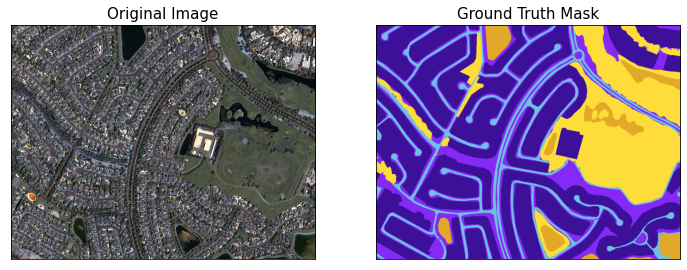
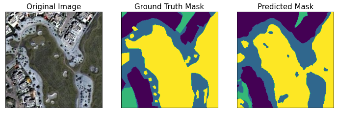
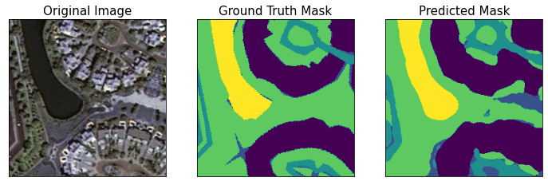
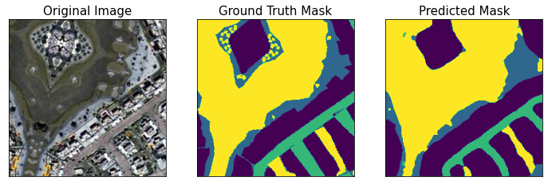

 
 
 

</a> 

 
     
       

# Semantic Segmentation of Aerial Imagery

## **About**

> Semantic segmentation, with the goal to assign semantic labels to every pixel in an image, is an essential computer vision task. In this project, we use semantic segmentation models to categorize content in aerial images of Dubai into six classes.

* Create custom datasets, dataloaders and transformers for semantic segmentation tasks.
* Build semantic segmentation models to classify an image at the pixel level. Implement performance metrics to keep tracking the training process.
* Test the model using aerial images of other cities.

## **Dataset**

All the training data used in this project are from [Semantic segmentation of aerial imagery](https://www.kaggle.com/datasets/humansintheloop/semantic-segmentation-of-aerial-imagery). The dataset consists of aerial imagery of Dubai obtained by MBRSC satellites and annotated with pixel-wise semantic segmentation in 6 classes (Building, Land, Road, etc.). The total volume of the dataset is 72 images grouped into 6 larger tiles. [UAVid Semantic Segmentation Dataset](https://www.kaggle.com/datasets/titan15555/uavid-semantic-segmentation-dataset) was also used to test the performance of the model.

##  **Preprocessing**

### **Cropping and Patchifying**

The total volume of the dataset is 72 images grouped into 8 larger tiles. To create a dataset with the same input size and for easier-to-apply data augmentation methods, we decomposed the original tiles into smaller patches (224*224). 2331 images and masks comprise the input dataset.

### **One-hot Encode Masks**
Since Class colours are in hex, whilst the mask images are in RGB. We need to convert the original masks in RGB and encode the output as integers for multi-class classification tasks. 

| Class | Class Name | Color Hex # | Color RGB |
|--|--|--|--|
|0|Unlabeled|9B9B9B|(226, 169, 41)|
|1|Building|3C1098|(60, 16, 152)|
|2|Land (unpaved area)|8429F6|(132, 41, 246)|
|3|Road|6EC1E4|(110, 193, 228)|
|4|Vegetation|FEDD3A|(254, 221, 58)|
|5|Water|E2A929|(80, 227, 194)|

## **Training Process**

* **Image Augmentation:** Apply mask augmentation methods for segmentation from `albumentations` (e.g. ShiftScaleRotate, RandomBrightnessContrast) on the train/val dataset.
* **Fine-Tuning Models:** Build the UNet model for multi-class semantic segmentation. Implement custom multiclass dice loss and mean IoU score functions. Train the image dataset using different pretrained encoders (e.g. resnet101, efficientnet-b4, mobilenet_v2).
* **Evaluation:** Evaluate the models on the test set and UAVid Semantic Segmentation Dataset. Display the predictions on images.

## **Results**

## **Demonstration**

## Reference
> [1] Ronneberger, O., Fischer, P., &amp; Brox, T. (2015, May 18). U-Net: Convolutional Networks for Biomedical Image Segmentation. arXiv.org. Retrieved March 20, 2023, from `https://arxiv.org/abs/1505.04597`
>
> [2] Humans In The Loop. (2020, May 29). Semantic segmentation of aerial imagery. Kaggle. Retrieved March 20, 2023, from `https://www.kaggle.com/datasets/humansintheloop/semantic-segmentation-of-aerial-imagery` 
>
> [3] Schmidt, J. (2023, January 18). Creating and training a U-net model with Pytorch for 2D &amp; 3D Semantic Segmentation: Dataset... Medium. Retrieved March 20, 2023, from `https://towardsdatascience.com/creating-and-training-a-u-net-model-with-pytorch-for-2d-3d-semantic-segmentation-dataset-fb1f7f80fe55`

## **Licence**

This repository is licensed under the Apache-2.0 License - see the [LICENSE](https://github.com/Followb1ind1y/Semantic-Segmentation-of-Aerial-Imagery/LICENSE) file for details.
